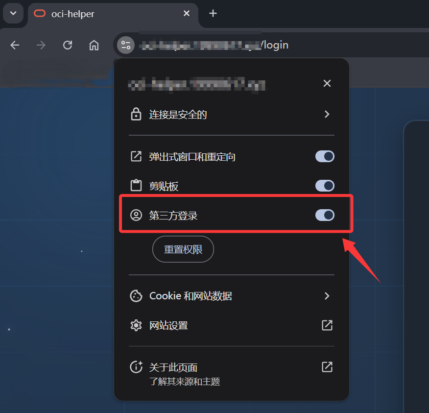

# Google 一键登录集成指南

---

## 🔧 Google OAuth 2.0 配置步骤

### 步骤 1: 访问 Google Cloud Console
打开 [Google Cloud Console](https://console.cloud.google.com/)

### 步骤 2: 创建项目
1. 点击顶部项目选择器
2. 点击"新建项目"
3. 输入项目名称（例如：`OCI Helper`）
4. 点击"创建"

### 步骤 3: 启用 Google Sign-In API
1. 在左侧菜单选择"API 和服务" → "库"
2. 搜索 "Google+ API" 或 "Google Sign-In API"
3. 点击"启用"

### 步骤 4: 创建 OAuth 2.0 凭据
1. 进入"API 和服务" → "凭据"
2. 点击"创建凭据" → "OAuth 客户端 ID"
3. 如果是首次创建，需要先配置"OAuth 同意屏幕"：
   - 用户类型：选择"外部"
   - 应用名称：填写您的应用名称
   - 用户支持电子邮件：填写您的邮箱
   - 开发者联系信息：填写您的邮箱
   - 点击"保存并继续"
   - 作用域：可以跳过
   - 测试用户：添加您的 Google 账号（开发阶段必须）
   - 点击"保存并继续"

4. 创建 OAuth 客户端 ID：
   - 应用类型：选择"Web 应用"
   - 名称：`OCI Helper Web`
   - 已获授权的 JavaScript 来源示例：
     ```
     http://localhost:5173
     http://localhost:8080
     https://yourdomain.com
     ```
   - 已获授权的重定向 URI 示例：
     ```
     http://localhost:5173
     http://localhost:8080
     https://yourdomain.com
     ```
   - 手机端已获授权的重定向 URI 示例：
     ```
     http://localhost:5173/google-callback
     http://localhost:8080/google-callback
     https://yourdomain.com/google-callback
     ```
   - 点击"创建"

5. **保存客户端 ID**（格式类似：`123456789-abcdefg.apps.googleusercontent.com`）

### 步骤 5: 在系统中配置
1. 登录系统
2. 进入"系统配置" → "基础配置"
3. 找到"Google OAuth 配置"卡片
4. 启用"Google 一键登录"开关
5. 粘贴 Google Client ID
6. 设置允许登录的 Google 账号
7. 点击"保存"按钮

---

## ❓ 常见问题

### Q1: 为什么看不到 Google 登录按钮？
**A**: 检查以下几点：
1. 系统配置中是否启用了"Google 一键登录"
2. 是否配置了有效的 Google Client ID
3. 浏览器控制台是否有错误信息

### Q2: 点击 Google 登录按钮没反应？
**A**: 可能的原因：
1. Google Client ID 配置错误
2. 当前域名未添加到 Google OAuth 授权来源
3. 浏览器拦截了弹出窗口（请允许浏览器开放权限，如下图所示）



### Q3: 登录失败，提示"该 Google 账号不在允许的域名列表中"
**A**: 检查系统配置中的"允许登录的 Google 账号后缀"是否包含您的邮箱后缀

### Q4: 开发环境提示"Access blocked: This app's request is invalid"
**A**: 
1. 确保在 OAuth 同意屏幕中添加了测试用户
2. 确保 `http://localhost:5173` 在授权来源列表中
3. 尝试清除浏览器缓存和 Cookie

### Q5: Token 验证失败
**A**: 检查：
1. 后端使用的 Client ID 是否与前端配置一致
2. Token 是否已过期
3. 服务器时间是否准确

### Q6: 如何限制只允许企业邮箱登录？
**A**: 在系统配置的"允许登录的 Google 账号后缀"中填写：`@yourcompany.com`

### Q7: 可以配置多个允许的域名吗？
**A**: 可以，使用逗号分隔，例如：`@gmail.com,@company1.com,@company2.com`

---

完成配置后，即可使用 Google 一键登录功能！
